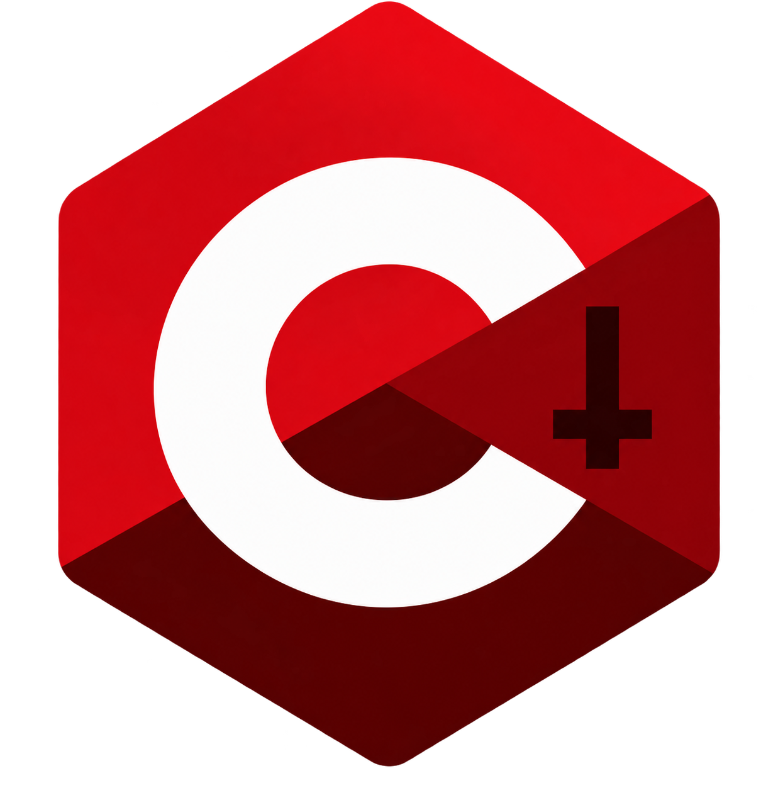

# Demonic C

<p align="center">
  
</p>

<p align="center">
  <strong>A self-hosting systems programming language that compiles to C with native performance and direct hardware access.</strong>
</p>

[](https://github.com/ak495867/Demonic-C/releases)
[](https://github.com/ak495867/Demonic-C/blob/main/LICENSE.md)
[](https://github.com/ak495867/Demonic-C/stargazers)
[](https://github.com/ak495867/Demonic-C/network/members)
[](https://github.com/ak495867/Demonic-C/issues)
[](https://github.com/ak495867/Demonic-C/commits/main)
[](https://github.com/ak495867/Demonic-C)
[](https://isocpp.org/)
[](https://en.wikipedia.org/wiki/C_(programming_language))
[](https://github.com/ak495867/Demonic-C)
[](https://clang.llvm.org/)
[](https://github.com/ak495867/Demonic-C)

> **Naming note:** the `.dmc` extension is a nod to *Devil May Cry* — the project's theme leans into a bit of style.

---

## Overview

Demonic C (DMC) is a systems programming language designed for low-level control without sacrificing modern language ergonomics. It compiles to portable C, which is then built with a standard C compiler toolchain — giving DMC programs the performance and portability of hand-written C, with a cleaner surface syntax on top.

DMC is **self-hosting**: its own compiler is written in DMC and can compile itself, producing a complete bootstrap chain that demonstrates the language is expressive enough to build real systems software, including compilers.

Core capabilities include:

- Direct memory management primitives
- Low-level hardware access (port I/O, inline assembly)
- Network programming (TCP sockets)
- File I/O
- Built-in collections (vectors, queues, maps)
- Mathematical and text-processing utilities
- Process and system-call control

---

## Project layout

| Folder | Purpose |
|---|---|
| `compiler/` | C++ compiler implementation |
| `runtime/` | Standalone C runtime |
| `stdlib/` | DMC standard-library modules |
| `tests/` | DMC test and bootstrap sources |
| `build/` | Makefile and build scripts |
| `bin/` | Built binaries and libraries |
| `docs/` | Documentation |
| `packages/` | Registry and package metadata |
| `editor/` | VS Code extension foundation |
| `playground/` | Browser playground foundation |
| `examples/` | Example projects |
| `config/` | Project configuration |
| `assets/` | Branding assets |

---

## Key features

### Memory management
- `mem_alloc()`, `mem_free()`, and byte-level read/write operations
- Arena allocation for high-performance, bulk-lifetime scenarios

### File operations
- Open, read, write, and close files
- Binary and text mode support

### Network programming
- TCP client connections
- Send/receive over sockets
- Cross-platform (Windows/Linux)

### Data structures
- Dynamic arrays (vectors)
- FIFO queues
- Hash maps
- Memory-mapped files

### Low-level access
- Inline assembly support
- Port I/O operations (x86)
- Interrupt handling
- System calls

### Mathematical and text functions
- Trigonometric, logarithmic, and exponential functions
- String manipulation utilities
- Type conversion functions

### Process and system control
- Argument access (`arg_text`, `proc_arg_count`)
- Process exit (`proc_exit`)
- System call interface
- Interrupt handling

---

## Self-hosting capability

The Demonic C compiler can:

1. Compile itself from DMC source into C
2. Have that generated C compiled into an executable
3. Use that executable to compile other DMC programs — including the compiler again

This closes a complete bootstrap chain, which stands as the language's proof of completeness: nothing in the compiler's own implementation requires a capability DMC itself lacks.

---

## Use cases

**Systems programming**
Operating system components, device drivers, embedded firmware, bootloaders.

**Performance-critical applications**
High-frequency trading systems, real-time signal processing, game engines, scientific computing.

**Security and reverse engineering**
Exploit development tooling, malware analysis, network sniffers, cryptographic implementations.

**Compiler construction**
Language translators, DSL implementations, code generators, static analysis tools.

---

## Building and usage

### Prerequisites
- Clang/LLVM (to build the compiler itself)
- Windows Subsystem for Linux, or native Windows build tools
- Winsock2 library (Windows only)

### Building the compiler

```bash
# Build the DMC compiler and runtime library
make

# Run the test suite
make test

# Run the runtime smoke test
make smoke
```

### Compiling DMC programs

```bash
# Compile a DMC program to C
./dmc-native program.dmc -o program.c

# Compile the generated C to an executable
clang program.c -o program -lws2_32   # Windows
# or
clang program.c -o program -lm        # Linux
```

Check version and run tests with `dmc --version` and `dmc test`.

### Self-hosting demonstration

```bash
# The compiler can compile itself
./dmc-native tests/emit.dmc -o _emit.c
clang _emit.c -o _emit.exe -lws2_32
./_emit.exe tests/selflex.dmc selflex_stage_out.c
clang selflex_stage_out.c -o selflex_stage.exe -lws2_32
./selflex_stage.exe   # Should exit with code 37
```

For the full language reference and CLI options, see [`USAGE.md`](USAGE.md).

---

## Language syntax overview

### Basic structure

```dmc
fn main() -> int {
    // Variables
    let x: int = 42;
    var y: string = "hello";

    // Control flow
    if (x > 0) {
        println(y);
    }

    // Loops
    for (let i: int = 0; i < 10; i = i + 1) {
        // ...
    }

    // Functions
    return helper(x);
}

fn helper(value: int) -> int {
    return value * 2;
}
```

### Memory operations

```dmc
// Allocate memory
let h = mem_alloc(1024);
if (h < 0) { proc_exit(1); }

// Write and read
mem_write(h, 0, 65);
let value = mem_read(h, 0);

// Free when done
mem_free(h);
```

### File operations

```dmc
let f = file_open("data.txt", "w");
if (f < 0) { proc_exit(1); }
file_write(f, "Hello, Demonic C!");
file_close(f);
```

### Network operations

```dmc
let sock = tcp_connect("example.com", 80);
if (sock < 0) { proc_exit(1); }
tcp_send(sock, "GET / HTTP/1.0\r\n\r\n");
let response = tcp_recv(sock, 4096);
tcp_close(sock);
```

---

## Architecture

### Compiler stages

1. **Lexical analysis** — converts source into tokens
2. **Parsing** — builds an AST from tokens
3. **Semantic analysis** — type checking and validation
4. **Code generation** — produces C code
5. **C compilation** — hands off to the system C compiler for the final binary

### Runtime library

Provides a portable abstraction over:

- POSIX/Windows APIs
- Memory management
- File and network operations
- Data structures
- Mathematical functions

---

## Contributing

Contributions are welcome. See [CONTRIBUTING.md](CONTRIBUTING.md) for guidelines on reporting issues, proposing features, and submitting pull requests.

## License

Demonic C is released under the MIT License. See [LICENSE.md](LICENSE.md) for details.